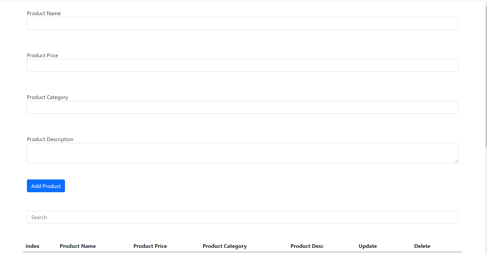
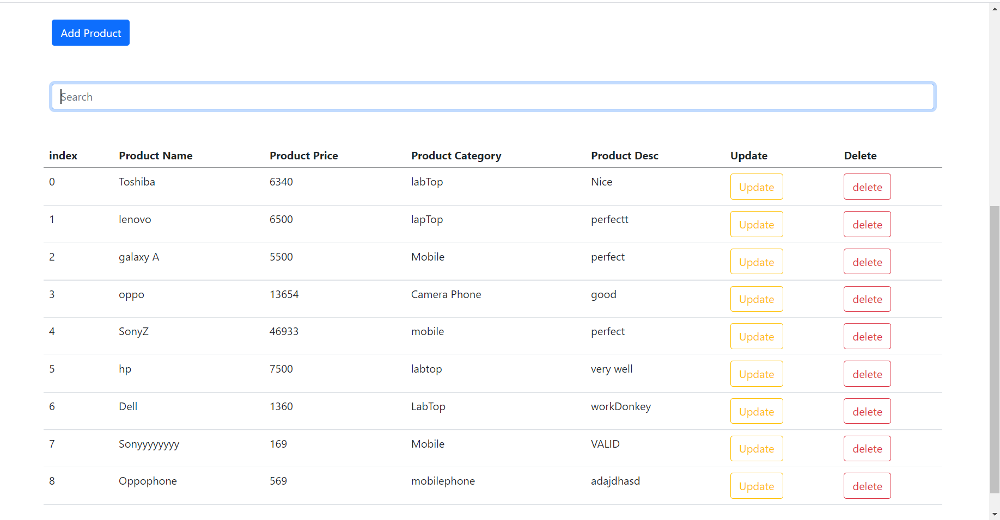
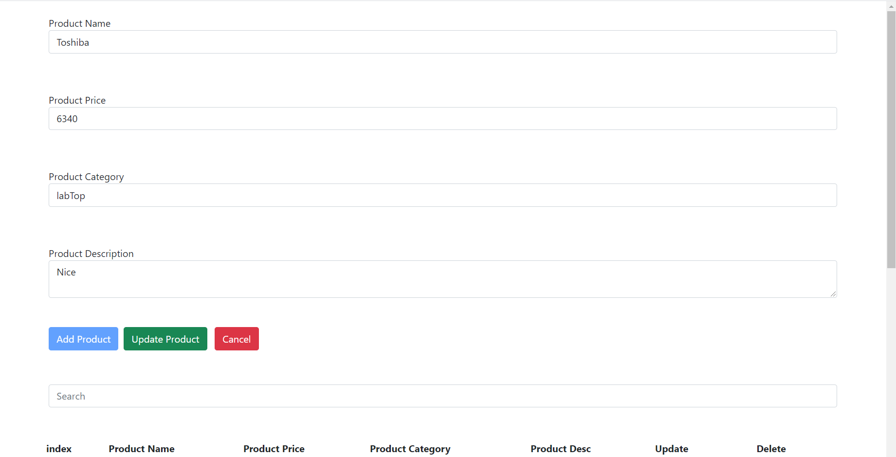
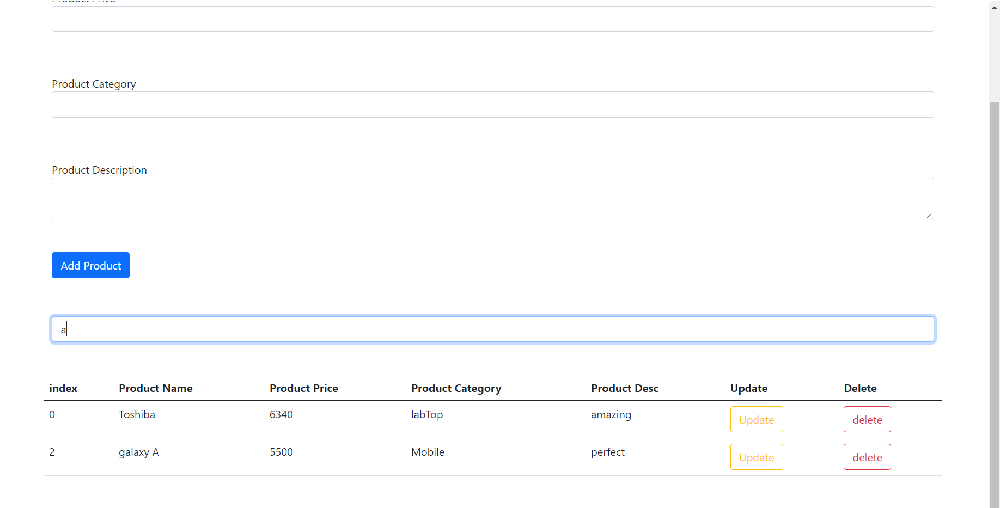

# crud-using-local-storage

#### The App can be used be used in many Fields as it contains the necessary operationswhich is :
  - **Add Product :** you can add products to your repositery and display all the content of the repositery on your screen . 
  - **Update Product :** you can update the product details by clicking on *update* button in the product row , then do some updates , click *update product* to save the updates .
     
  - **Delete Product :** delete any product from the repository by clicking the *delete* button in the product row .
  - **Search By Product Name :**  Search according to the product name , if the product name contain what you search for the product will appear . 
